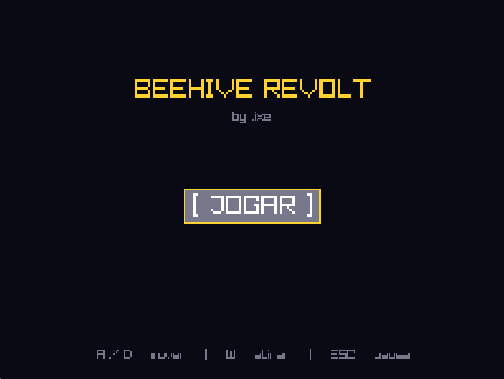
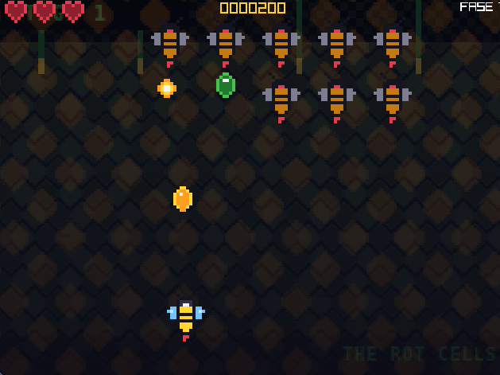
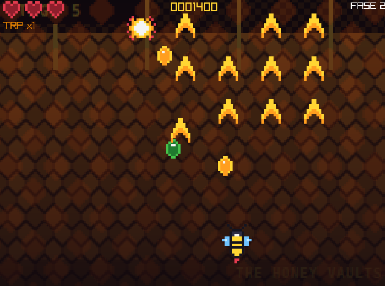
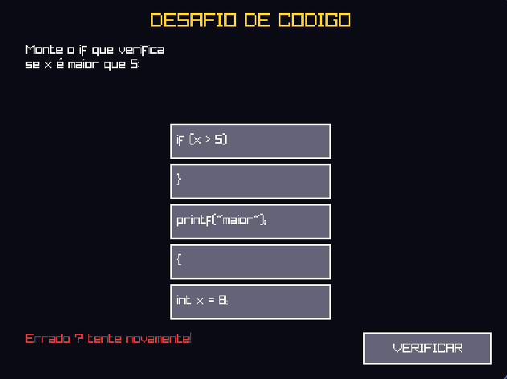
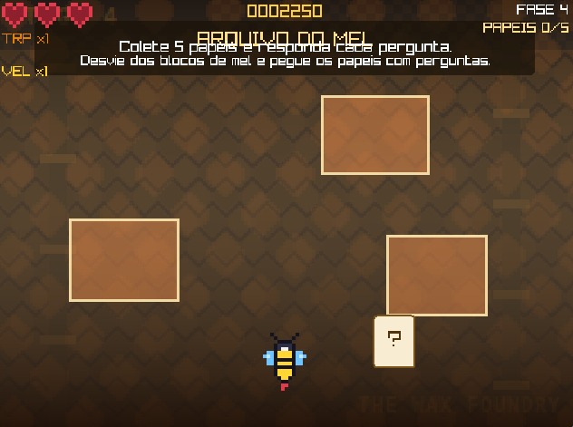

# BEEHIVE REVOLT

A 2D action game built with [raylib](https://www.raylib.com/), written in C.

Take control of a bee in a hexagonal hive and fight against invading wasps, drones, and the queen to reclaim your home.

## Building

### Dependencies

- [raylib](https://www.raylib.com/) (tested with raylib 5.0+)
- GCC or compatible C compiler
- GNU Make
- `pkg-config` (Linux)

### Build & Run

```sh
make
make run
```

### Tests

```sh
make test
```

## Gameplay

- **Player**: Fly as a bee using keyboard/mouse controls
- **Enemies**: Wasp enemies, drone enemies, and a queen boss
- **Combat**: Fire honey shots, collect pollen and power-ups
- **Campaign**: Progress through multiple stages with cutscenes
- **Quiz**: Quick quiz feature integrated into the game

## Screenshots







## Team

| Name | Role |
|------|------|
| Arthur Leite da Cruz Pessoa | |
| Eduardo Augusto Pereira Rodrigues | |
| Francisco Oliveira Junior | |
| Gabriel Lucas Soares da Silva | |
| Gilberto Dias Da Silva Neto | |
| Giuliano Marques Minelli | |

## License

MIT
